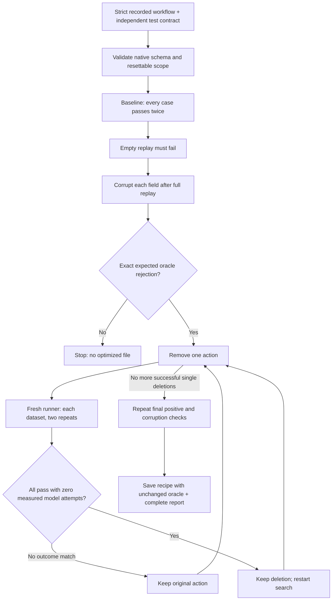

# Replay minimization with an audited outcome oracle

The Recorder onboarding produced `fill_roboform_test_form-4638754e`: eight native actions for four fields. The saved JSON includes three clicks after inputs and two City inputs. These are plausible redundancies, but the appearance of repetition is not proof that an action can be removed. Native input defaults to `fill`, which replaces the field value through `input_text_locator` in `handle_command.py`; repeated `type` operations would have different semantics. The experiment tests outcomes rather than assuming all repeated inputs are redundant.

Two additions address that problem together:

1. **Replay-tested deletion:** remove one action, execute the candidate from a fresh browser, and retain the deletion only if every supplied dataset passes repeatedly.
2. **Counterfactual oracle audit:** deliberately produce wrong final values and require the existing outcome checker to reject them. An optimizer must not benefit from a checker that forgets to inspect City.

These are known testing ideas applied to the browser replay boundary, not a claim of a novel algorithm. Their value here is the experiment, the reuse of the real engine, and the explicit refusal to optimize against an inadequate check.

## Observed results — 2 October 2026

The strong contract completed **77 real-browser trials** and retained original zero-based indices `[0, 2, 4, 7]`: four fills plus the unchanged oracle in the output. Three follow-up clicks and the earlier City write were removed. Every positive candidate required both datasets and two repeats. The final four-action recipe passed all four positive runs, followed by repeated empty/corruption controls.

The intentionally weak contract completed five trials: two ordinary successes, two expected empty-replay failures, then a wrong-City result that the defective checker accepted. The experiment rejected promotion and wrote no optimized recipe. All **82 experiment trials measured zero LiteLLM attempts**. There is no additional model-token saving to claim relative to the already model-free strict baseline.

| Measure | Observed result |
|---|---|
| Native browser actions | 8 → 4 (50% fewer) |
| Strong-contract trials | 4 baseline, 40 empty/corruption controls, 29 deletion trials, 4 final positives |
| Supplied field corruptions | All 32 rejected at the exact intended assertion, before/after minimization |
| Weak-oracle experiment | Wrong City survived; promotion refused |
| Focused tests | 51 passing across both forks |
| Baseline median (4 runs) | 18.232 seconds |
| Final median (4 runs) | 9.5145 seconds |

Timing is a small sequential observation with shared machine load and non-random order, not a statistical speed claim. Compact receipts are in `evidence/recorder-experiment.json`; the runnable output is `evidence/recorder-optimized.json`. Full trial inputs/logs/receipts are produced by the reproduction commands below.

## Evidence and scope

`evidence/recorder-source.json` transcribes the full JSON read from the saved workflow's editor. It preserves the generated eight-node order, CSS-escaped commands, parameter references, and default example values. The captured values were `myname`, `xyz`, `abc`, and `SF`; the hosted generator instead supplied example defaults and parameterized those fields.

`scripts/prepare_recording_demo.py` generates a local strict copy plus two test contracts. It adds command-only strict policy, bounds retries/timeouts, and removes end-of-node sleeps. It does **not** reorder or delete the recorded actions. Comparisons are between that strict eight-action copy and its minimized variant, not between an untouched hosted recording and the local fork.

The strong contract checks four field values across two datasets:

| Case | Full Name | Address 1 | Address 2 | City |
|---|---|---|---|---|
| captured | myname | xyz | abc | SF |
| different-data | Ada Lovelace | 42 Test Road | Unit 7 | New Delhi |

Parameter replacement uses Optexity's existing mechanism. Nothing is inferred from arbitrary text, and no provider API credential is needed.

## Execution flow



Infrastructure failures, missing call measurements, unexpected error messages, timeouts, and the run budget abort the experiment. They are never treated as successful negative tests. The graph's search ends when a full pass finds no removable action.

## Exact example: why City needs its own check

Suppose the action sequence writes all four correct values. A checker accidentally verifies only name and address. Ordinary replay is green. Removing both City writes could also remain green. The optimizer would be exploiting a missing requirement.

Our corruption probe executes the full sequence, then uses a strict native input action to set City to `__wrong__`, then runs the unchanged oracle. The expected receipt is:

```json
{"status": "failed", "error": "oracle:13adr_city", "llm": {"attempts": 0}}
```

That is the expected result shape, not a substitute for a run receipt. A browser crash with `status=failed` does not count: the error must match the declared assertion exactly. Likewise, a failure at Full Name does not prove the City check works.

The deliberately weak contract omits only the City assertion. It should pass the ordinary baseline and fail the experiment when corrupted City survives. This is an authored test defect, not a claim that Optexity's hosted generator supplied a faulty oracle; the hosted recording supplied no such four-field assertion.

The empty-replay control checks a separate failure mode: a prefilled page or a vacuous checker might report success even when no actions ran. Fresh browser processes and this control reduce that risk. Fresh browsers do not reset remote databases.

## Functions and ownership

| Function | Input → output | Responsibility |
|---|---|---|
| `prepare` | Saved recording dictionary → strict copy, contract | Preserve actions while adding local test policy; create explicit datasets and probes |
| `_validate` | Workflow and contract → validation or error | Reuse `Automation.model_validate`; require flat strict input/click nodes, named cases, script oracle, strict input probes |
| `run_experiment` | Workflow, contract, async evaluator → report | Own deletion search and acceptance policy; never invoke browser actions directly |
| nested `assemble` | Original indices, case, optional probe → fresh trial workflow | Copy selected actions, bind case inputs, append probe and unchanged oracle |
| nested `trial` | Trial description → whether outcome passed | Enforce budget; preserve receipt; reject missing/model-call measurement; distinguish assertion rejection from infrastructure failure |
| nested `passes` | Candidate indices → boolean | Require all cases and repetitions; reject candidate on the first legitimate outcome mismatch |
| nested `audit` | Candidate indices → success or exception | Run empty controls and field corruptions; require intended assertion failures |
| `LocalEvaluator.__call__` | Trial JSON and unique label → existing runner receipt | Write trial, launch existing runner, enforce deadline, check exit/receipt agreement |
| `main` | CLI arguments → files and exit code | Refuse output-directory reuse; save report; write optimized recipe only after successful checks |

`LocalEvaluator` invokes `run_local_automation.py --offline --forbid-llm`. That existing runner creates a Task, starts an isolated browser, calls the ordinary automation engine, and measures its LiteLLM boundary. Native input/click handlers, schema validation, parameter substitution, script execution, and strict failure policy remain the same. There is no second browser replay executor and no new production dependency.

The experiment input contains action nodes only; its oracle is supplied separately in the contract. Recorder JSON naturally has that shape. A compiler-produced recipe with a trailing assertion needs that assertion separated explicitly rather than passed directly to this tool.

The JSON contract is deliberately small. It consists of `resettable`, named `cases`, each case's `input_parameters`, an independent `oracle` node, and named input `probes` with an exact `expected_error`. Trusted local files may contain executable Python and locator expressions, just as ordinary Optexity automations do. This tool is not a sandbox.

## Reproduce

From the Optexity fork using the existing editable environment:

```bash
../.venv/bin/python -m scripts.prepare_recording_demo
../.venv/bin/python -m scripts.replay_experiment \
  evidence/recorder-strict.json evidence/recorder-contract.json \
  --output-dir /tmp/optexity-recorder-experiment --max-runs 100
```

Use a new output directory for every invocation. There may be dozens of fresh-browser runs; this is an offline optimization cost, not the cost of each subsequent replay. The evaluator uses a dedicated local child-process ID of 81 (CDP port 9303); do not run concurrent experiments with that same worker slot. Use `--child-process-id` to reserve a different unused slot; the expected weak-oracle run used 82.

Successful output contains:

- `report.json`: workflow/contract hashes, repeats, budget, each trial's case, original action indices, outcome, reason, timing, and measured calls.
- `optimized.json`: retained native actions **plus the first case's unchanged oracle and verified inputs**. Other tested cases remain in the contract.
- Per-trial `automation.json`, `runner.log`, and the normal engine's `run_result.json` and task artifacts.

To demonstrate a defective outcome checker:

```bash
../.venv/bin/python -m scripts.replay_experiment \
  evidence/recorder-strict.json evidence/recorder-weak-contract.json \
  --output-dir /tmp/optexity-weak-oracle --max-runs 30
```

Expected: nonzero exit, `promoted=false`, an audit failure identifying surviving corruption, and **no** `optimized.json`. Do not change the tool to make this demonstration return success.

To replay a produced recipe without repeating the search:

```bash
../.venv/bin/python scripts/run_local_automation.py \
  /tmp/optexity-recorder-experiment/optimized.json --forbid-llm
```

## Interview explanation

**What did you add?** “First I made learning replayable. Then I asked whether the replay contained unnecessary work. Rather than deleting repeated-looking actions, I tested each deletion against an independent outcome contract. Before trusting that contract, I deliberately broke each required output and checked that it rejected the result.”

**Why not ask an LLM which steps are redundant?** “A model can propose candidates, but it cannot establish that a focus event or repeated click has no needed effect. For eight actions, trying bounded deletions is small and auditable. The browser experiment decides; no inference calls are needed.”

**Why audit the oracle before optimization?** “The optimizer rewards whatever the test measures. If the test forgets City, an invalid recipe can score perfectly. A wrong-City control reveals that blind spot before it affects the optimized artifact.”

**Is this a proof?** “No. It establishes equivalence only for these asserted outcomes, datasets, and fresh starts. It does not establish backend-effect equivalence, cover every input, or guarantee tomorrow's DOM. The mutation audit is only as broad as its supplied fault model.”

**Why keep the oracle immutable?** “Otherwise the search could improve its score by weakening the test. Candidate actions vary; requirements do not. The output retains the original checker, and hashes bind the report to the input workflow and contract.”

**What does minimal mean?** “A greedy fixed point: no remaining single action can be deleted while passing the tested contract. It is order-dependent and not a globally shortest workflow. Exhaustive subset search would grow exponentially; a bounded simple search fits this take-home.”

**How expensive is it?** “For n actions, c cases, and r repeats, the restart-on-deletion search can use O(n²cr) executions; corruption audits add work proportional to supplied probes. The hard run budget and per-run deadline bound the experiment. Optimization cost must be amortized over future replays.”

**What would production need?** “A real reset protocol, explicit side-effect contracts, broader representative inputs and browser states, flaky-outcome policy, concurrent worker isolation, signed/approved promotion records, and cache invalidation. I kept those limits visible rather than presenting this fixture experiment as a general production optimizer.”

## Limits that affect interpretation

- `resettable=true` is an explicit caller declaration, not verified rollback. Never use deletion experiments on payments, messages, submissions, or other irreversible workflows.
- Only flat strict input/click recipes are accepted. Existing learning/compiler coverage remains separate; this tool does not make unsupported actions compilable.
- Corrupting one field at a time does not test combinations, hidden network effects, focus/blur semantics, or completeness of the human requirement.
- Two datasets and two repeats establish a bounded demonstration, not a statistical reliability guarantee.
- A reduced action count is not automatically a proportional latency reduction. Use measured receipts and state timing scope; do not extrapolate API billing from local call counters.
- The experiment refuses missing metrics and nonzero measured LiteLLM attempts. That boundary is not a network firewall for arbitrary Python scripts.
- The hosted schema still does not support our strict flag. These results are for the local fork; the saved hosted recording is preserved.
- LLM-assisted compilation and general adaptive repair remain unimplemented. This addition covers a narrow iterative delete/replay loop.
